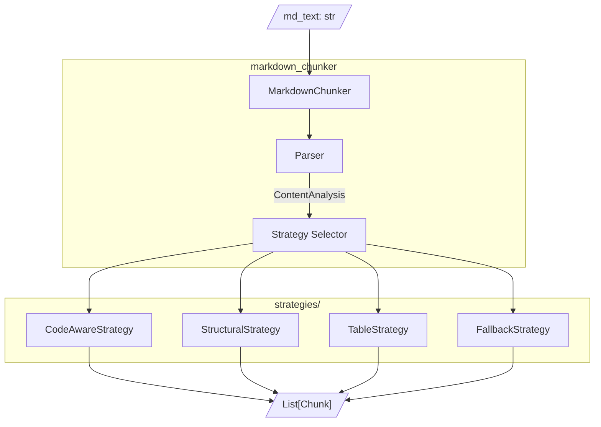

# Simplification Recommendations

## Обзор

Рекомендации по упрощению архитектуры на основе проведённого аудита.

---

## Модули для объединения/удаления

### Рекомендация 1: Объединить types.py

**Текущее состояние:**
- `chunker/types.py` — 1079 строк
- `parser/types.py` — 931 строк

**Рекомендация:** Объединить в один `types.py` в корне пакета.

**Ожидаемый результат:** ~1000 строк (удаление дублирования)

### Рекомендация 2: Удалить deprecated Simple API

**Текущее состояние:**
```python
# parser/__init__.py - 8 deprecated функций
analyze, check_markdown_quality, check_quality,
extract_code_blocks, get_code, get_document_structure,
get_structure, parse_markdown, quick_analyze
```

**Рекомендация:** Удалить полностью.

### Рекомендация 3: Удалить backward compatibility код

**Текущее состояние:**
- `ParserInterface = Stage1Interface`
- `ValidationError = MarkdownParsingError`
- Try/except imports с fallback-определениями

**Рекомендация:** Удалить алиасы и fallback-код.

### Рекомендация 4: Объединить overlap managers

**Текущее состояние:**
- `components/overlap_manager.py` — 926 строк (legacy)
- `block_overlap_manager.py` — 263 строки (new)

**Рекомендация:** Оставить только block-based, удалить legacy.

### Рекомендация 5: Объединить validators

**Текущее состояние:**
- `validator.py`
- `dedup_validator.py`
- `regression_validator.py`
- `header_path_validator.py`
- `DataCompletenessValidator`

**Рекомендация:** Один `validator.py` с одним классом.

---

## Консолидация стратегий

### Рекомендация 6: Объединить Code + Mixed

**Текущее состояние:**
- `code_strategy.py` — 624 строки
- `mixed_strategy.py` — 848 строк

**Общий код:** Обработка code blocks, определение языка.

**Рекомендация:** Одна `CodeAwareStrategy` для документов с кодом.

### Рекомендация 7: Удалить ListStrategy

**Текущее состояние:**
- `list_strategy.py` — 856 строк
- Исключена из auto-mode: `safe_strategies = [s for s in self.strategies if s.name != "list"]`

**Рекомендация:** Удалить полностью (не используется).

### Рекомендация 8: Упростить StructuralStrategy

**Текущее состояние:**
- `structural_strategy.py` — 1720 строк
- Содержит Phase 2 и block-based логику

**Рекомендация:** Разбить на:
- `structural_strategy.py` — ~500 строк (core logic)
- Вынести section_builder в utils

### Предлагаемая структура стратегий

| Было | Станет |
|------|--------|
| CodeStrategy | → CodeAwareStrategy |
| MixedStrategy | → (объединена с Code) |
| ListStrategy | → (удалена) |
| TableStrategy | → TableStrategy (без изменений) |
| StructuralStrategy | → StructuralStrategy (упрощена) |
| SentencesStrategy | → FallbackStrategy |

**Итого:** 6 → 4 стратегии

---

## Параметры для удаления

### Рекомендация 9: Удалить неиспользуемые параметры

| Параметр | Причина удаления |
|----------|------------------|
| `enable_streaming` | Не реализовано |
| `streaming_threshold` | Не реализовано |
| `fallback_strategy` | Hardcoded в коде |
| `max_fallback_level` | Используется только в одном месте |

### Рекомендация 10: Объединить overlap параметры

**Было:**
```python
overlap_size: int = 200
overlap_percentage: float = 0.1
enable_overlap: bool = True
block_based_overlap: bool = True
```

**Станет:**
```python
overlap_size: int = 200  # 0 = disabled
```

### Рекомендация 11: Удалить MC-* параметры

После стабилизации сделать поведение по умолчанию:

| Параметр | Действие |
|----------|----------|
| `block_based_splitting` | Удалить (всегда True) |
| `allow_oversize_for_integrity` | Удалить (всегда True) |
| `min_effective_chunk_size` | Удалить (вычислять автоматически) |
| `block_based_overlap` | Удалить (всегда True) |
| `detect_url_pools` | Удалить (всегда True) |
| `enable_content_validation` | Удалить (всегда True) |

### Предлагаемая конфигурация

```python
@dataclass
class ChunkConfig:
    # Размеры (3 параметра)
    max_chunk_size: int = 4096
    min_chunk_size: int = 512
    overlap_size: int = 200  # 0 = disabled
    
    # Поведение (3 параметра)
    preserve_atomic_blocks: bool = True  # code, tables
    extract_preamble: bool = True
    
    # Пороги (2 параметра)
    code_threshold: float = 0.3
    structure_threshold: int = 3  # min headers
```

**Итого:** 32 → 8 параметров

---

## Эскиз упрощённой архитектуры

### Текущая структура (55 файлов)

```
markdown_chunker/
├── __init__.py
├── logging_config.py
├── api/                    # 5 файлов
├── chunker/                # 26 файлов
│   ├── components/         # 5 файлов
│   └── strategies/         # 8 файлов
└── parser/                 # 15 файлов
```

### Предлагаемая структура (12 файлов)

```
markdown_chunker/
├── __init__.py             # Public API
├── types.py                # Все типы данных
├── config.py               # ChunkConfig (8 параметров)
├── chunker.py              # MarkdownChunker (main class)
├── parser.py               # Парсинг markdown
├── strategies/
│   ├── __init__.py
│   ├── base.py             # BaseStrategy
│   ├── code_aware.py       # Code + Mixed
│   ├── structural.py       # Structural (упрощённая)
│   ├── table.py            # Table
│   └── fallback.py         # Sentences (fallback)
└── utils.py                # Общие утилиты
```

### Диаграмма новой архитектуры



---

## План миграции

### Фаза 1: Подготовка (1-2 дня)

1. Создать новую структуру папок
2. Написать 8 property-based тестов для core properties
3. Убедиться, что текущий код проходит эти тесты

### Фаза 2: Редизайн (3-5 дней)

1. Реализовать новый `types.py`
2. Реализовать новый `config.py` (8 параметров)
3. Реализовать новый `parser.py`
4. Реализовать 4 стратегии
5. Реализовать новый `chunker.py`

### Фаза 3: Валидация (1-2 дня)

1. Прогнать property-based тесты
2. Прогнать integration тесты на реальных документах
3. Сравнить результаты с текущей реализацией

### Фаза 4: Cleanup (1 день)

1. Удалить старый код
2. Обновить документацию
3. Обновить README

---

## Ожидаемые результаты

| Метрика | Было | Станет | Изменение |
|---------|------|--------|-----------|
| Файлов | 55 | 12 | -78% |
| Строк кода | ~24,000 | ~5,000 | -79% |
| Параметров конфигурации | 32 | 8 | -75% |
| Стратегий | 6 | 4 | -33% |
| Тестов | 1853 | ~50 | -97% |
| Строк тестов | ~45,600 | ~2,000 | -96% |

---

## Риски и митигация

| Риск | Митигация |
|------|-----------|
| Потеря функциональности | Property-based тесты гарантируют core properties |
| Регрессии | Сравнение результатов на реальных документах |
| Потеря edge cases | Сохранить regression тесты для известных багов |
| Несовместимость API | Сохранить публичный API (MarkdownChunker, ChunkConfig) |
