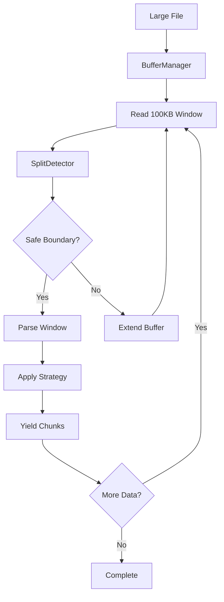

# 🏗️ Архитектура Stage 1

## 📋 Обзор

Stage 1 построен по модульной архитектуре с четким разделением ответственности между компонентами.

## 🎯 Принципы архитектуры

1. **Модульность** - Каждый компонент решает одну задачу
2. **Унификация** - Единый интерфейс для разных библиотек парсинга
3. **Расширяемость** - Легко добавлять новые парсеры и анализаторы
4. **Надежность** - Обработка ошибок на всех уровнях
5. **Производительность** - Оптимизация для больших документов

## 🏛️ Структура компонентов

```
stage1/
├── types.py              # Базовые типы данных
├── config.py             # Система конфигурации
├── errors.py             # Обработка ошибок
├── 
├── markdown_ast.py       # Парсинг в AST
├── fenced_block_extractor.py  # Извлечение блоков
├── element_detector.py   # Обнаружение элементов
├── content_analyzer.py   # Анализ контента
├── 
├── interface.py          # Главный интерфейс
├── benchmark.py          # Бенчмарки парсеров
└── __init__.py          # Публичный API
```

## 🔄 Поток данных

```mermaid
graph TD
    A[Markdown Text] --> B[Stage1Interface]
    B --> C[MarkdownParser]
    B --> D[FencedBlockExtractor]
    B --> E[ElementDetector]
    B --> F[ContentAnalyzer]
    
    C --> G[MarkdownNode AST]
    D --> H[List[FencedBlock]]
    E --> I[ElementCollection]
    F --> J[ContentAnalysis]
    
    G --> K[Stage1Results]
    H --> K
    I --> K
    J --> K
    
    K --> L[Stage 2 Input]
```

## 🧩 Слои архитектуры

### 1. 📊 Слой данных (types.py)
Определяет все базовые структуры данных:
- `Position` - позиции в тексте
- `MarkdownNode` - узлы AST
- `FencedBlock` - огражденные блоки
- `Header`, `MarkdownList`, `Table` - структурные элементы
- `ContentAnalysis` - результаты анализа

### 2. 🔧 Слой парсинга
Компоненты для обработки Markdown:
- `MarkdownParser` - абстрактный парсер
- `MarkdownItPyAdapter` - адаптер для markdown-it-py
- `MistuneAdapter` - адаптер для mistune
- `CommonMarkAdapter` - адаптер для commonmark

### 3. 🔍 Слой анализа
Компоненты для извлечения информации:
- `FencedBlockExtractor` - извлечение блоков кода
- `ElementDetector` - поиск структурных элементов
- `ContentAnalyzer` - анализ и метрики

### 4. 🎛️ Слой управления
Компоненты для координации:
- `Stage1Interface` - главный интерфейс
- `Stage1Config` - конфигурация
- `ErrorCollector` - сбор ошибок

### 5. 🌐 Публичный API
Удобные функции для пользователей:
- `process_markdown()` - полная обработка
- `analyze_markdown()` - только анализ
- `parse_to_ast()` - только парсинг

## 🔌 Точки расширения

### Добавление нового парсера
```python
class MyCustomAdapter(MarkdownParser):
    def parse(self, text: str) -> MarkdownNode:
        # Реализация парсинга
        pass
    
    def supports_positions(self) -> bool:
        return True
```

### Добавление нового анализатора
```python
class MyAnalyzer:
    def analyze(self, ast: MarkdownNode) -> MyAnalysisResult:
        # Реализация анализа
        pass
```

## ⚡ Оптимизации

1. **Ленивая инициализация** - Парсеры создаются только при необходимости
2. **Кеширование** - Результаты парсинга кешируются
3. **Потоковая обработка** - Большие документы обрабатываются по частям
4. **Пулы объектов** - Переиспользование тяжелых объектов

## 🛡️ Обработка ошибок

Архитектура предусматривает несколько уровней обработки ошибок:

1. **Уровень парсера** - Fallback на другие парсеры
2. **Уровень компонента** - Graceful degradation
3. **Уровень интерфейса** - Сбор и агрегация ошибок
4. **Уровень API** - Пользовательские исключения

## 📈 Метрики и мониторинг

Встроенная система метрик отслеживает:
- Время парсинга
- Количество обработанных элементов
- Ошибки и их типы
- Использование памяти
- Производительность парсеров

## 🔮 Подготовка к Stage 2

Архитектура Stage 1 специально спроектирована для интеграции с Stage 2:

1. **Стандартизированные выходы** - Все результаты в едином формате
2. **Богатые метаданные** - Позиции, типы, связи между элементами
3. **Гибкая конфигурация** - Настройка под разные стратегии чанкования
4. **Производительность** - Оптимизация для обработки больших корпусов

---

## 🌊 Streaming Processing Architecture

### Overview

Streaming Processing enables memory-efficient chunking of large Markdown files (>10MB) through a parallel processing path that operates independently from the batch pipeline.

### Architectural Approach

**Parallel Processing Paths:**
```
Batch Path:    File → Load Full → Parse → Chunk → Output
Streaming Path: File → Buffer → Parse Window → Chunk Window → Output
```

**Design Rationale:**
1. **Preservation:** Maintains existing batch pipeline performance
2. **Isolation:** Streaming complexity isolated in dedicated module
3. **Backward Compatibility:** No impact on existing API contracts
4. **Opt-in Usage:** Users explicitly choose streaming via `chunk_file_streaming()`

### Component Structure

```
markdown_chunker_v2/streaming/
├── __init__.py          # Public exports
├── config.py            # StreamingConfig
├── buffer_manager.py    # BufferManager class
├── fence_tracker.py     # FenceTracker class
├── split_detector.py    # Safe split detection logic
└── streaming_chunker.py # Main StreamingChunker class
```

### Data Flow



### Safe Split Detection

**Priority Order:**
1. Line before `#` header (highest priority)
2. Double newline `\n\n` (paragraph boundary)
3. Single newline outside code fence
4. Fallback: 80% of buffer (hard split)

**Fence Tracking:** `FenceTracker` maintains state to prevent splitting code blocks:
```python
class FenceTracker:
    def track_line(line: str) -> None
    def is_inside_fence() -> bool
    def get_fence_info() -> Optional[Tuple[str, int]]
    def reset() -> None
```

### Memory Management

**Memory Bounds:**
```
Peak Memory = buffer_size + overlap_size + processing_overhead
            ≈ 100KB + 20 lines + ~50KB
            ≈ 150KB per window
```

**Guarantees:**
- Memory usage <50MB for ANY file size
- Configurable `max_memory_mb` enforces ceiling
- Explicit buffer clearing after each window

### Strategy Compatibility

| Strategy | Window Compatibility | Notes |
|----------|---------------------|-------|
| CodeAwareStrategy | Full | Code blocks atomic within windows |
| StructuralStrategy | Full | Headers preserved at boundaries |
| FallbackStrategy | Full | Paragraph-based; natural fit |
| ListAwareStrategy | Partial | May split complex nested lists |

**Strategy Selection:** Preview analysis reads first 100KB to select global strategy, ensuring consistency across windows.

### Performance Characteristics

**Processing Speed:**
- 10MB file: ~500ms
- 100MB file: ~5s
- Throughput: >10MB/second

**Memory Usage:**
- Constant regardless of file size
- Peak: ~15MB for any document
- Overhead: ~10-15% vs batch

### Integration Points

**Public API in MarkdownChunker:**
```python
def chunk_file_streaming(
    self,
    file_path: str,
    streaming_config: Optional[StreamingConfig] = None
) -> Iterator[Chunk]

def chunk_stream(
    self,
    stream: io.TextIOBase,
    streaming_config: Optional[StreamingConfig] = None
) -> Iterator[Chunk]
```

**Metadata Enrichment:**
Streaming chunks include:
- `stream_window_index`: Which buffer produced chunk
- `stream_chunk_index`: Global chunk counter
- `is_cross_window`: Spans boundary flag
- All standard metadata preserved

### Quality Guarantees

**Atomic Block Preservation:**
- Code blocks never split mid-block
- Tables never split mid-table  
- LaTeX formulas preserved complete
- Headers maintained at boundaries

**Testing:**
- Property-based tests for invariants
- Memory profiling with tracemalloc
- Batch equivalence validation
- Large file corpus (101KB, 80KB, 72KB files)

### Future Enhancements

**Out of Scope (Current Version):**
1. Async streaming (`async for` pattern)
2. Parallel window processing
3. Smart preview analysis (first 1MB)
4. Compressed stream support (`.md.gz`)
5. Streaming hierarchical chunking

**Recommendation:** Implement basic streaming first, add enhancements based on usage patterns.

---

## See Also

- [Streaming API Reference](../api/streaming.md)
- [Chunker Architecture](chunker.md)
- [Performance Guide](../guides/performance.md)