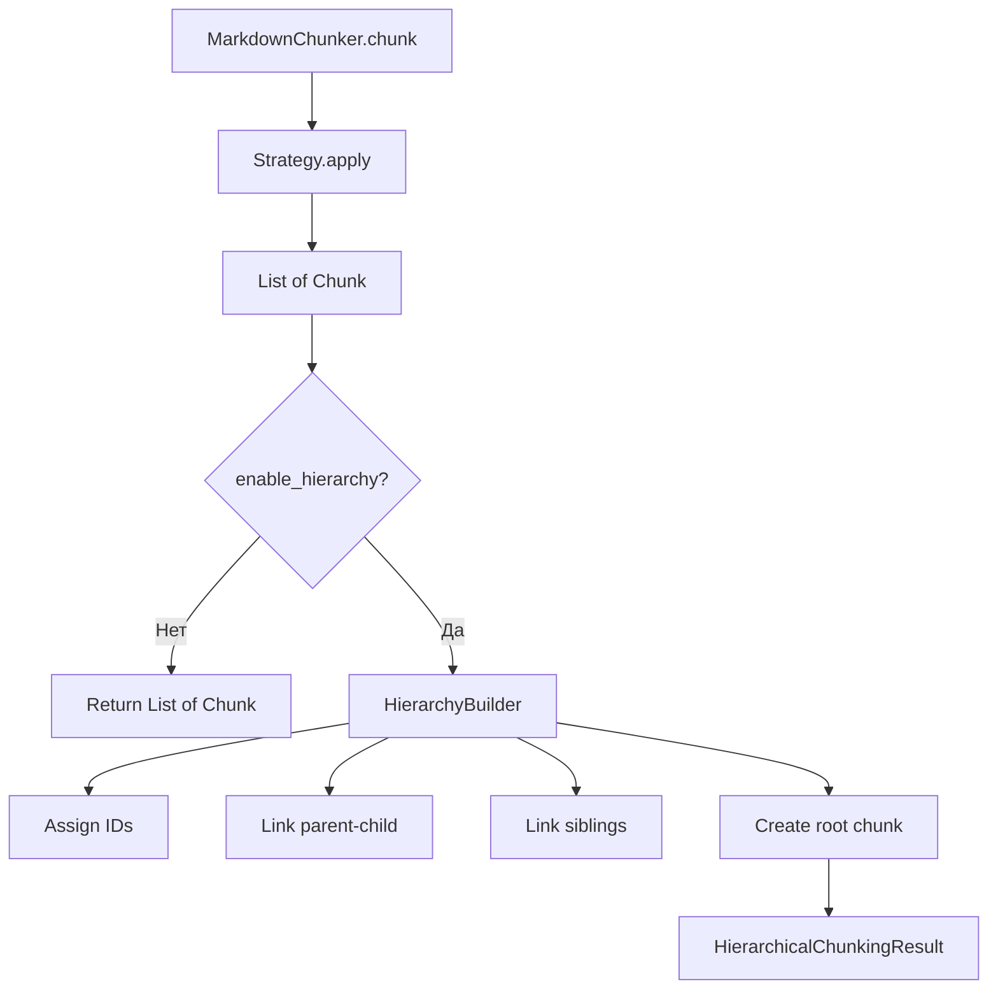

# Feature 11: Hierarchical Chunking

## Краткое описание

Создание иерархии чанков (parent-child) для многоуровневого retrieval. Поддержка Document → Section → Subsection → Paragraph levels.

---

## Метаданные

| Параметр | Значение |
|----------|----------|
| **Фаза** | 4 — Продвинутые возможности |
| **Приоритет** | MEDIUM |
| **Effort** | 10-14 дней (пересмотрено с учётом интеграции) |
| **Impact** | High |
| **Уникальность** | Partial (LlamaIndex имеет аналог, но наша система уже имеет `header_path`) |
| **Зависимости** | StructuralStrategy, Parser, Chunk types |

---

## Анализ текущего состояния

### Существующие возможности

Проект **уже имеет** частичную поддержку иерархии через метаданные:

1. **`header_path`** — строка формата `/Level1/Level2/Level3`:
   ```python
   chunk.metadata["header_path"] = "/Introduction/Getting Started/Installation"
   ```

2. **`section_tags`** — список заголовков внутри чанка (дети root section):
   ```python
   chunk.metadata["section_tags"] = ["Prerequisites", "Quick Start", "Troubleshooting"]
   ```

3. **`header_level`** — уровень корневого заголовка (1-6):
   ```python
   chunk.metadata["header_level"] = 2  # ## level
   ```

### Чего не хватает

| Возможность | Текущее состояние | Требуется |
|-------------|-------------------|------------|
| Parent-child ID связи | ❌ Нет | ✅ `parent_id`, `children_ids` |
| Sibling навигация | ❌ Нет | ✅ `prev_sibling_id`, `next_sibling_id` |
| Document-level chunk | ❌ Нет | ✅ Root chunk с summary |
| Multi-level retrieval | ❌ Нет | ✅ Retrieve на разных уровнях |
| Summary generation | ❌ Нет | ⚠️ Требует LLM или эвристики |

---

## Проблема

### Ограничения flat structure

1. **Потеря контекста:**
   - Чанк о деталях API не связан с overview секцией
   - Retrieval может вернуть детали без контекста
   - `header_path` даёт путь, но не ID для навигации

2. **Навигация:**
   - Невозможно программно "подняться" к parent секции
   - Невозможно "спуститься" к sub-секциям
   - Нет sibling-переходов между секциями одного уровня

3. **Multi-level retrieval:**
   - Для overview вопросов нужны высокоуровневые чанки
   - Для detail вопросов нужны детальные чанки
   - Нет способа запросить "все дети секции X"

---

## Решение

### Стратегия интеграции

Предлагается **расширение существующей архитектуры**, а не создание параллельного класса:

1. **Расширить `Chunk`** из `markdown_chunker_v2/types.py` новыми метаданными
2. **Добавить `HierarchyBuilder`** как post-processing шаг
3. **Создать `HierarchicalChunkingResult`** как wrapper с навигационными методами

### Архитектура



### Типы данных

```python
from dataclasses import dataclass, field
from typing import Optional, List, Dict
from enum import Enum


class ChunkLevel(Enum):
    """Уровни иерархии чанков."""
    DOCUMENT = 0      # Весь документ / summary
    SECTION = 1       # H1 секции
    SUBSECTION = 2    # H2 секции
    PARAGRAPH = 3     # H3+ и параграфы


# Расширение метаданных существующего Chunk:
# chunk.metadata получает новые поля:
HIERARCHY_METADATA_FIELDS = {
    "chunk_id": str,           # Уникальный ID (короткий hash, не UUID)
    "parent_id": Optional[str], # ID родительского чанка
    "children_ids": List[str],  # ID дочерних чанков
    "prev_sibling_id": Optional[str],  # ID предыдущего sibling
    "next_sibling_id": Optional[str],  # ID следующего sibling
    "hierarchy_level": int,     # 0=document, 1=section, 2=subsection, 3=paragraph
    "is_leaf": bool,            # Есть ли дети
}


@dataclass
class HierarchicalChunkingResult:
    """
    Результат иерархического chunking.
    
    Не создаёт новый тип Chunk, а использует существующий
    с расширенными метаданными.
    """
    chunks: List["Chunk"]  # Все чанки включая root
    root_id: str           # ID document-level chunk
    strategy_used: str     # Использованная стратегия
    
    # Индекс для быстрого поиска O(1)
    _index: Dict[str, "Chunk"] = field(default_factory=dict, repr=False)
    
    def __post_init__(self):
        """Build index on creation."""
        self._index = {
            c.metadata.get("chunk_id"): c 
            for c in self.chunks 
            if c.metadata.get("chunk_id")
        }
    
    def get_chunk(self, chunk_id: str) -> Optional["Chunk"]:
        """Найти чанк по ID. O(1) через индекс."""
        return self._index.get(chunk_id)
    
    def get_children(self, chunk_id: str) -> List["Chunk"]:
        """Получить дочерние чанки."""
        chunk = self.get_chunk(chunk_id)
        if not chunk:
            return []
        children_ids = chunk.metadata.get("children_ids", [])
        return [self.get_chunk(cid) for cid in children_ids if self.get_chunk(cid)]
    
    def get_parent(self, chunk_id: str) -> Optional["Chunk"]:
        """Получить родительский чанк."""
        chunk = self.get_chunk(chunk_id)
        if not chunk:
            return None
        parent_id = chunk.metadata.get("parent_id")
        return self.get_chunk(parent_id) if parent_id else None
    
    def get_ancestors(self, chunk_id: str) -> List["Chunk"]:
        """Получить всех предков (от parent до root)."""
        ancestors = []
        current = self.get_chunk(chunk_id)
        while current:
            parent_id = current.metadata.get("parent_id")
            if not parent_id:
                break
            parent = self.get_chunk(parent_id)
            if parent:
                ancestors.append(parent)
            current = parent
        return ancestors
    
    def get_siblings(self, chunk_id: str) -> List["Chunk"]:
        """Получить всех sibling чанков (включая себя)."""
        chunk = self.get_chunk(chunk_id)
        if not chunk:
            return []
        parent_id = chunk.metadata.get("parent_id")
        if not parent_id:
            return [chunk]  # Root не имеет siblings
        return self.get_children(parent_id)
    
    def get_flat_chunks(self) -> List["Chunk"]:
        """
        Получить только leaf чанки для обычного retrieval.
        
        Это обеспечивает обратную совместимость с системами,
        которые не поддерживают иерархию.
        """
        return [c for c in self.chunks if c.metadata.get("is_leaf", True)]
    
    def get_by_level(self, level: int) -> List["Chunk"]:
        """Получить чанки определённого уровня."""
        return [
            c for c in self.chunks 
            if c.metadata.get("hierarchy_level") == level
        ]
    
    def to_tree_dict(self) -> Dict:
        """
        Преобразовать в древовидную структуру для сериализации.
        
        Избегает круговых ссылок через ID.
        """
        def build_node(chunk_id: str) -> Dict:
            chunk = self.get_chunk(chunk_id)
            if not chunk:
                return {}
            return {
                "id": chunk_id,
                "content_preview": chunk.content[:100] + "..." if len(chunk.content) > 100 else chunk.content,
                "header_path": chunk.metadata.get("header_path", ""),
                "level": chunk.metadata.get("hierarchy_level", 0),
                "children": [
                    build_node(cid) 
                    for cid in chunk.metadata.get("children_ids", [])
                ]
            }
        return build_node(self.root_id)
```

### HierarchyBuilder

```python
import hashlib
from typing import List, Optional, Dict
from .types import Chunk, Header


class HierarchyBuilder:
    """
    Строит иерархию на основе существующих чанков.
    
    Использует существующие header_path и header_level
    для определения отношений parent-child.
    """
    
    def __init__(self, include_document_summary: bool = True):
        """
        Args:
            include_document_summary: Создавать ли document-level chunk
        """
        self.include_document_summary = include_document_summary
    
    def build(
        self, 
        chunks: List[Chunk], 
        original_text: str
    ) -> HierarchicalChunkingResult:
        """
        Построить иерархию.
        
        Args:
            chunks: Список чанков от MarkdownChunker
            original_text: Исходный текст для summary
            
        Returns:
            HierarchicalChunkingResult с навигационными методами
        """
        if not chunks:
            return HierarchicalChunkingResult([], "", "none")
        
        # 1. Назначить ID всем чанкам
        self._assign_ids(chunks)
        
        # 2. Создать document-level chunk (root)
        all_chunks = list(chunks)
        root_chunk = None
        if self.include_document_summary:
            root_chunk = self._create_root_chunk(original_text, chunks)
            all_chunks.insert(0, root_chunk)
        
        # 3. Построить parent-child связи
        self._build_parent_child_links(all_chunks, root_chunk)
        
        # 4. Построить sibling связи
        self._build_sibling_links(all_chunks)
        
        # 5. Определить уровни иерархии
        self._assign_hierarchy_levels(all_chunks)
        
        # 6. Отметить leaf чанки
        self._mark_leaves(all_chunks)
        
        root_id = root_chunk.metadata["chunk_id"] if root_chunk else chunks[0].metadata["chunk_id"]
        strategy = chunks[0].metadata.get("strategy", "unknown") if chunks else "none"
        
        return HierarchicalChunkingResult(all_chunks, root_id, strategy)
    
    def _generate_id(self, content: str, index: int) -> str:
        """
        Сгенерировать короткий уникальный ID.
        
        Использует 8-символьный hash вместо UUID для экономии места.
        """
        data = f"{content[:50]}:{index}".encode()
        return hashlib.sha256(data).hexdigest()[:8]
    
    def _assign_ids(self, chunks: List[Chunk]) -> None:
        """Назначить chunk_id всем чанкам."""
        for i, chunk in enumerate(chunks):
            chunk.metadata["chunk_id"] = self._generate_id(chunk.content, i)
    
    def _create_root_chunk(self, text: str, chunks: List[Chunk]) -> Chunk:
        """
        Создать document-level chunk.
        
        Содержит summary документа (первые N символов или preamble).
        """
        # Извлечь заголовок документа
        title = "Document"
        for chunk in chunks:
            hp = chunk.metadata.get("header_path", "")
            if hp and hp != "/__preamble__":
                # Первый сегмент пути — заголовок
                parts = hp.strip("/").split("/")
                if parts:
                    title = parts[0]
                    break
        
        # Summary: preamble или первые 500 символов
        summary = ""
        preamble_chunks = [c for c in chunks if c.metadata.get("content_type") == "preamble"]
        if preamble_chunks:
            summary = preamble_chunks[0].content
        else:
            summary = text[:500].rsplit("\n", 1)[0]  # До границы строки
        
        root_chunk = Chunk(
            content=f"# {title}\n\n{summary}",
            start_line=1,
            end_line=chunks[-1].end_line if chunks else 1,
            metadata={
                "chunk_id": self._generate_id(title, -1),
                "content_type": "document",
                "header_path": f"/{title}",
                "header_level": 0,
                "parent_id": None,
                "children_ids": [],
                "hierarchy_level": 0,
                "is_root": True,
            }
        )
        return root_chunk
    
    def _build_parent_child_links(
        self, 
        chunks: List[Chunk], 
        root_chunk: Optional[Chunk]
    ) -> None:
        """
        Построить parent-child связи на основе header_path.
        
        Логика: chunk B является дитём chunk A, если:
        - header_path(B) начинается с header_path(A) + "/"
        - или header_level(B) > header_level(A) и они соседние
        """
        # Индекс по header_path для быстрого поиска родителя
        path_to_chunk: Dict[str, Chunk] = {}
        
        for chunk in chunks:
            hp = chunk.metadata.get("header_path", "")
            if hp:
                path_to_chunk[hp] = chunk
        
        for chunk in chunks:
            if chunk.metadata.get("is_root"):
                continue
                
            hp = chunk.metadata.get("header_path", "")
            if not hp or hp == "/__preamble__":
                # Preamble — дитя root
                if root_chunk:
                    chunk.metadata["parent_id"] = root_chunk.metadata["chunk_id"]
                    root_chunk.metadata["children_ids"].append(chunk.metadata["chunk_id"])
                continue
            
            # Найти родителя: удаляем последний сегмент пути
            parts = hp.strip("/").split("/")
            parent_found = False
            
            for i in range(len(parts) - 1, 0, -1):
                parent_path = "/" + "/".join(parts[:i])
                if parent_path in path_to_chunk:
                    parent = path_to_chunk[parent_path]
                    chunk.metadata["parent_id"] = parent.metadata["chunk_id"]
                    parent.metadata.setdefault("children_ids", []).append(
                        chunk.metadata["chunk_id"]
                    )
                    parent_found = True
                    break
            
            # Если родитель не найден, привязать к root
            if not parent_found and root_chunk:
                chunk.metadata["parent_id"] = root_chunk.metadata["chunk_id"]
                root_chunk.metadata["children_ids"].append(chunk.metadata["chunk_id"])
    
    def _build_sibling_links(self, chunks: List[Chunk]) -> None:
        """
        Построить sibling связи.
        
        Siblings — чанки с одинаковым parent_id,
        упорядоченные по start_line.
        """
        # Группировать по parent_id
        siblings_by_parent: Dict[str, List[Chunk]] = {}
        for chunk in chunks:
            parent_id = chunk.metadata.get("parent_id")
            if parent_id:
                siblings_by_parent.setdefault(parent_id, []).append(chunk)
        
        # Связать siblings
        for parent_id, sibs in siblings_by_parent.items():
            sibs.sort(key=lambda c: c.start_line)
            for i, chunk in enumerate(sibs):
                if i > 0:
                    chunk.metadata["prev_sibling_id"] = sibs[i-1].metadata["chunk_id"]
                if i < len(sibs) - 1:
                    chunk.metadata["next_sibling_id"] = sibs[i+1].metadata["chunk_id"]
    
    def _assign_hierarchy_levels(self, chunks: List[Chunk]) -> None:
        """Назначить уровни иерархии на основе header_level."""
        for chunk in chunks:
            if chunk.metadata.get("is_root"):
                chunk.metadata["hierarchy_level"] = 0
            else:
                header_level = chunk.metadata.get("header_level", 3)
                # Map: H1->1, H2->2, H3+->3
                chunk.metadata["hierarchy_level"] = min(header_level, 3)
    
    def _mark_leaves(self, chunks: List[Chunk]) -> None:
        """Отметить leaf чанки."""
        for chunk in chunks:
            children = chunk.metadata.get("children_ids", [])
            chunk.metadata["is_leaf"] = len(children) == 0
```

### Интеграция с MarkdownChunker

```python
# В markdown_chunker_v2/chunker.py

class MarkdownChunker:
    def __init__(self, config: Optional[ChunkConfig] = None):
        self.config = config or ChunkConfig()
        self._parser = Parser()
        self._selector = StrategySelector()
        self._hierarchy_builder = HierarchyBuilder(
            include_document_summary=self.config.include_document_summary
        )
    
    def chunk(self, md_text: str) -> List[Chunk]:
        # ... существующий код ...
        pass
    
    def chunk_hierarchical(self, md_text: str) -> HierarchicalChunkingResult:
        """
        Создать иерархическую структуру чанков.
        
        Новый метод для иерархического режима.
        Существующий chunk() остаётся для обратной совместимости.
        """
        # 1. Обычный chunking
        chunks = self.chunk(md_text)
        
        # 2. Построить иерархию
        return self._hierarchy_builder.build(chunks, md_text)
```

---

## Usage Examples

### Basic Usage

```python
from markdown_chunker_v2 import MarkdownChunker, ChunkConfig

config = ChunkConfig(
    max_chunk_size=2000,
    # include_document_summary=True  # Новый параметр (TODO)
)
chunker = MarkdownChunker(config)

# Обычный flat chunking (обратная совместимость)
flat_chunks = chunker.chunk(markdown_text)

# Иерархический режим
result = chunker.chunk_hierarchical(markdown_text)

# Доступ к root
root = result.get_chunk(result.root_id)
print(f"Document: {root.metadata.get('header_path')}")

# Доступ к секциям
for child in result.get_children(result.root_id):
    print(f"  Section: {child.metadata.get('header_path')}")
    for subchild in result.get_children(child.metadata['chunk_id']):
        print(f"    - {subchild.metadata.get('header_path')}")
```

### Multi-Level Retrieval

```python
from typing import List, Dict, Callable
from markdown_chunker_v2 import Chunk

def retrieve_with_context(
    query: str, 
    result: HierarchicalChunkingResult,
    search_fn: Callable[[str, List[Chunk]], List[Chunk]]
) -> List[Dict]:
    """
    Retrieval с иерархическим контекстом.
    
    Возвращает чанки с дополнительным контекстом от родителей.
    """
    # 1. Найти leaf чанки для поиска
    leaf_chunks = result.get_flat_chunks()
    matches = search_fn(query, leaf_chunks)
    
    enriched = []
    for match in matches:
        chunk_id = match.metadata.get("chunk_id")
        
        # 2. Получить родительский контекст
        ancestors = result.get_ancestors(chunk_id)
        
        # 3. Собрать breadcrumb
        breadcrumb = " > ".join([
            a.metadata.get("header_path", "").split("/")[-1] 
            for a in reversed(ancestors)
        ])
        
        # 4. Добавить parent summary если есть
        parent = result.get_parent(chunk_id)
        parent_context = parent.content[:200] if parent else ""
        
        enriched.append({
            "chunk": match,
            "breadcrumb": breadcrumb,
            "parent_context": parent_context,
            "siblings": [
                s.metadata.get("header_path") 
                for s in result.get_siblings(chunk_id)
            ]
        })
    
    return enriched
```

### Hierarchical Summarization

```python
def hierarchical_summary(result: HierarchicalChunkingResult) -> str:
    """
    Создать иерархическое summary документа.
    
    Использует структуру для создания оглавления.
    """
    root = result.get_chunk(result.root_id)
    
    lines = []
    lines.append(f"# {root.metadata.get('header_path', 'Document').strip('/')}")
    lines.append("")
    lines.append(root.content[:300] + "..." if len(root.content) > 300 else root.content)
    lines.append("")
    lines.append("## Table of Contents")
    lines.append("")
    
    def add_toc(chunk_id: str, depth: int = 0):
        for child in result.get_children(chunk_id):
            header = child.metadata.get("header_path", "").split("/")[-1]
            indent = "  " * depth
            lines.append(f"{indent}- {header}")
            add_toc(child.metadata["chunk_id"], depth + 1)
    
    add_toc(result.root_id)
    
    return "\n".join(lines)
```

---

## Подводные камни и риски

### Архитектурные проблемы

| Проблема | Описание | Решение |
|----------|-----------|----------|
| **Дублирование с header_path** | Система уже имеет `header_path` | Использовать `header_path` как базу для построения иерархии |
| **4-strategy architecture** | Разные стратегии создают разные структуры | HierarchyBuilder работает post-hoc с любыми чанками |
| **UUID размер** | UUID занимают 36 символов каждый | Использовать 8-символьный hash |
| **Круговые ссылки** | parent → child → parent | Ссылки через ID, не объекты |
| **Preamble обработка** | Preamble не имеет header_path | Специальная обработка `/__preamble__` |

### Проблемы производительности

| Проблема | Воздействие | Решение |
|----------|-------------|----------|
| **O(n²) поиск чанков** | Медленно на больших документах | Индекс `_index: Dict[str, Chunk]` |
| **Большие документы (>100 headers)** | Много children_ids | Lazy loading, pagination |
| **Память для дерева** | Дублирование контента на уровнях | Root chunk содержит только summary |

### Проблемы интеграции

| Проблема | Описание | Решение |
|----------|-----------|----------|
| **Dify ограничения** | Dify может не поддерживать иерархию | Вернуть flat с метаданными |
| **LlamaIndex adapter** | Нужен специальный адаптер | См. Feature 08 |
| **Summary generation** | Требует LLM | Эвристика: первые 500 симв. или preamble |
| **Обратная совместимость** | Существующий API должен работать | `chunk()` остаётся, добавляется `chunk_hierarchical()` |

### Краевые случаи

1. **Документ без заголовков:**
   - Весь документ — один leaf chunk
   - Root chunk содержит summary

2. **Только заголовки без контента:**
   - Каждый заголовок — отдельный chunk
   - Sibling связи между ними

3. **Очень глубокая иерархия (H6):**
   - H3+ мапятся на `hierarchy_level=3`
   - Но header_path сохраняет полную глубину

4. **Микс стратегий:**
   - CodeAware может создавать чанки без чёткой иерархии
   - HierarchyBuilder использует header_path как ориентир

5. **Несколько чанков с одинаковым header_path:**
   - При split больших секций
   - Все становятся siblings

---

## Тестирование

### Unit Tests

```python
import pytest
from markdown_chunker_v2 import MarkdownChunker, ChunkConfig


class TestHierarchyBuilder:
    """Тесты построения иерархии."""
    
    @pytest.fixture
    def chunker(self):
        return MarkdownChunker(ChunkConfig(max_chunk_size=500))
    
    def test_creates_hierarchy(self, chunker):
        """Иерархия создаётся корректно."""
        text = """# Document Title

## Section 1

Content of section 1.

## Section 2

Content of section 2.

### Subsection 2.1

More content.
"""
        result = chunker.chunk_hierarchical(text)
        
        # Root создан
        root = result.get_chunk(result.root_id)
        assert root is not None
        assert root.metadata.get("hierarchy_level") == 0
        
        # Root имеет детей
        children = result.get_children(result.root_id)
        assert len(children) >= 2
    
    def test_parent_child_links(self, chunker):
        """Все parent-child связи корректны."""
        text = "# Doc\n\n## Sec1\n\nText\n\n## Sec2\n\nMore"
        result = chunker.chunk_hierarchical(text)
        
        for chunk in result.chunks:
            parent_id = chunk.metadata.get("parent_id")
            if parent_id:
                parent = result.get_chunk(parent_id)
                assert parent is not None, f"Parent {parent_id} not found"
                children_ids = parent.metadata.get("children_ids", [])
                assert chunk.metadata["chunk_id"] in children_ids
    
    def test_sibling_links(self, chunker):
        """Все sibling связи корректны."""
        text = "# Doc\n\n## Sec1\n\nA\n\n## Sec2\n\nB\n\n## Sec3\n\nC"
        result = chunker.chunk_hierarchical(text)
        
        # Найти секции (level 2)
        sections = [c for c in result.chunks if c.metadata.get("header_level") == 2]
        sections.sort(key=lambda c: c.start_line)
        
        for i, section in enumerate(sections):
            # Prev sibling
            if i > 0:
                prev_id = section.metadata.get("prev_sibling_id")
                assert prev_id == sections[i-1].metadata["chunk_id"]
            else:
                assert section.metadata.get("prev_sibling_id") is None
            
            # Next sibling
            if i < len(sections) - 1:
                next_id = section.metadata.get("next_sibling_id")
                assert next_id == sections[i+1].metadata["chunk_id"]
            else:
                assert section.metadata.get("next_sibling_id") is None
    
    def test_get_ancestors(self, chunker):
        """Путь от leaf до root."""
        text = "# Doc\n\n## Sec\n\n### Sub\n\nContent"
        result = chunker.chunk_hierarchical(text)
        
        # Найти самый глубокий чанк
        deepest = max(result.chunks, key=lambda c: c.metadata.get("header_level", 0))
        ancestors = result.get_ancestors(deepest.metadata["chunk_id"])
        
        # Должен быть путь до root
        assert len(ancestors) >= 1
        # Последний — root
        assert ancestors[-1].metadata.get("chunk_id") == result.root_id
    
    def test_get_flat_chunks(self, chunker):
        """Только leaf чанки."""
        text = "# Doc\n\n## Sec\n\nText"
        result = chunker.chunk_hierarchical(text)
        
        flat = result.get_flat_chunks()
        
        for chunk in flat:
            assert chunk.metadata.get("is_leaf") == True
            assert len(chunk.metadata.get("children_ids", [])) == 0
    
    def test_get_by_level(self, chunker):
        """Чанки по уровню."""
        text = "# Doc\n\n## Sec1\n\nA\n\n## Sec2\n\nB"
        result = chunker.chunk_hierarchical(text)
        
        level_0 = result.get_by_level(0)
        assert len(level_0) == 1  # Root
        
        level_2 = result.get_by_level(2)
        assert len(level_2) >= 2  # Sections


class TestHierarchyEdgeCases:
    """Краевые случаи."""
    
    @pytest.fixture
    def chunker(self):
        return MarkdownChunker(ChunkConfig(max_chunk_size=500))
    
    def test_document_without_headers(self, chunker):
        """Документ без заголовков."""
        text = "Just plain text without any headers."
        result = chunker.chunk_hierarchical(text)
        
        # Root создан
        assert result.root_id
        # Flat chunks возвращает контент
        flat = result.get_flat_chunks()
        assert len(flat) >= 1
    
    def test_only_headers(self, chunker):
        """Документ только с заголовками."""
        text = "# H1\n\n## H2\n\n### H3"
        result = chunker.chunk_hierarchical(text)
        
        # Не должно упасть
        assert len(result.chunks) >= 1
    
    def test_preamble_handling(self, chunker):
        """Преамбула привязывается к root."""
        text = "Some preamble text.\n\n# Main Title\n\nContent."
        result = chunker.chunk_hierarchical(text)
        
        preamble = [c for c in result.chunks 
                    if c.metadata.get("content_type") == "preamble"]
        
        if preamble:
            # Preamble — дитя root
            assert preamble[0].metadata.get("parent_id") == result.root_id
    
    def test_deep_hierarchy(self, chunker):
        """Глубокая иерархия (H6)."""
        text = """# L1
## L2
### L3
#### L4
##### L5
###### L6

Deep content.
"""
        result = chunker.chunk_hierarchical(text)
        
        # Не должно упасть
        assert len(result.chunks) >= 1
        # Root создан
        assert result.get_chunk(result.root_id) is not None
    
    def test_same_header_path_chunks(self, chunker):
        """Несколько чанков с одинаковым header_path."""
        # Очень длинная секция, которая будет разбита на части
        long_content = "\n\n".join([f"Paragraph {i}." * 20 for i in range(10)])
        text = f"# Doc\n\n## Long Section\n\n{long_content}"
        
        config = ChunkConfig(max_chunk_size=200)
        small_chunker = MarkdownChunker(config)
        result = small_chunker.chunk_hierarchical(text)
        
        # Много чанков с одинаковым path
        paths = [c.metadata.get("header_path") for c in result.chunks]
        long_section_chunks = [c for c in result.chunks 
                               if "Long Section" in c.metadata.get("header_path", "")]
        
        # Они должны быть siblings
        if len(long_section_chunks) > 1:
            for i in range(1, len(long_section_chunks)):
                prev_id = long_section_chunks[i].metadata.get("prev_sibling_id")
                # Или siblings, или один parent
                parent1 = long_section_chunks[i-1].metadata.get("parent_id")
                parent2 = long_section_chunks[i].metadata.get("parent_id")
                assert parent1 == parent2 or prev_id is not None
    
    def test_empty_document(self, chunker):
        """Пустой документ."""
        result = chunker.chunk_hierarchical("")
        
        # Не должно упасть
        assert result.chunks == []
    
    def test_to_tree_dict_no_circular_refs(self, chunker):
        """Сериализация без круговых ссылок."""
        import json
        
        text = "# Doc\n\n## Sec\n\nText"
        result = chunker.chunk_hierarchical(text)
        
        tree = result.to_tree_dict()
        
        # Должно сериализоваться без ошибок
        json_str = json.dumps(tree)
        assert len(json_str) > 0


class TestHierarchyCorpus:
    """Тесты на реальных документах."""
    
    CORPUS_FILES = [
        "tests/corpus/github_readmes/python/youtube-dl.md",
        "tests/corpus/github_readmes/javascript/axios.md",
        "tests/corpus/changelogs/changelogs_005.md",
    ]
    
    @pytest.fixture
    def chunker(self):
        return MarkdownChunker(ChunkConfig(max_chunk_size=2000))
    
    @pytest.mark.parametrize("filepath", CORPUS_FILES)
    def test_corpus_hierarchy_invariants(self, chunker, filepath):
        """Инварианты иерархии на реальных файлах."""
        from pathlib import Path
        
        path = Path(filepath)
        if not path.exists():
            pytest.skip(f"File {filepath} not found")
        
        text = path.read_text(encoding="utf-8")
        result = chunker.chunk_hierarchical(text)
        
        # Инвариант 1: Root создан
        assert result.root_id
        
        # Инвариант 2: Все чанки имеют chunk_id
        for chunk in result.chunks:
            assert chunk.metadata.get("chunk_id"), f"Missing chunk_id"
        
        # Инвариант 3: Один root
        roots = [c for c in result.chunks if c.metadata.get("parent_id") is None]
        assert len(roots) == 1
        
        # Инвариант 4: Все children_ids ссылаются на существующие чанки
        for chunk in result.chunks:
            for child_id in chunk.metadata.get("children_ids", []):
                assert result.get_chunk(child_id), f"Invalid child_id: {child_id}"
        
        # Инвариант 5: Все parent_id ссылаются на существующие чанки
        for chunk in result.chunks:
            parent_id = chunk.metadata.get("parent_id")
            if parent_id:
                assert result.get_chunk(parent_id), f"Invalid parent_id: {parent_id}"
```

---

## Ожидаемые улучшения

### Use Cases

| Use Case | Без иерархии | С иерархией |
|----------|--------------|-------------|
| Overview вопросы | Возвращает детали | Возвращает section summary |
| Detail вопросы | OK | OK + context from parent |
| Navigation | Нет | Parent/child/sibling links |
| Summarization | Плоский список | Иерархическое summary |
| "What's in section X?" | Невозможно | `get_children(section_id)` |
| Breadcrumb навигация | Вручную через header_path | `get_ancestors(chunk_id)` |

### Метрики успеха

| Метрика | Текущее | Цель |
|---------|----------|------|
| Navigation API coverage | 0% | 100% |
| Backward compatibility | N/A | 100% |
| Overhead на метаданные | 0 | <15% на chunk |
| Производительность build | N/A | O(n) |

---

## Зависимости

### Изменяет

| Файл | Изменение |
|------|----------|
| `markdown_chunker_v2/types.py` | Добавить `ChunkLevel` enum |
| `markdown_chunker_v2/hierarchy.py` | Новый: `HierarchyBuilder`, `HierarchicalChunkingResult` |
| `markdown_chunker_v2/chunker.py` | Добавить `chunk_hierarchical()` |
| `markdown_chunker_v2/config.py` | Добавить `include_document_summary` |
| `tools/markdown_chunk_tool.py` | Добавить `enable_hierarchy` параметр |

### Совместимость

| Компонент | Статус |
|-----------|--------|
| `MarkdownChunker.chunk()` | Остаётся без изменений |
| Существующие стратегии | Не затрагиваются |
| `Chunk` dataclass | Метаданные расширяются (опционально) |
| Dify plugin output | Добавляется `hierarchy` объект |

### Связанные features

| Feature | Связь |
|---------|------|
| Feature 08: LlamaIndex Adapter | Использует иерархию для TreeIndex |
| Feature 09: Semantic Chunking | Может дополнять иерархию |
| Overlap Management | Независима, но совместима |

---

## Риски

| Риск | Вероятность | Влияние | Митигация |
|------|-------------|---------|----------|
| Complexity | High | Medium | Разделение на HierarchyBuilder |
| Storage overhead | Medium | Low | 8-символьные ID, lazy fields |
| Integration complexity | Medium | Medium | Опциональный режим |
| Performance regression | Low | Medium | O(n) алгоритм, индексы |
| Breaking changes | Low | High | Отдельный метод `chunk_hierarchical()` |

---

## Acceptance Criteria

### Обязательные

- [ ] `chunk_hierarchical()` возвращает `HierarchicalChunkingResult`
- [ ] Document-level chunk (root) создаётся автоматически
- [ ] Parent-child relationships корректны (инвариант тесты)
- [ ] Sibling relationships корректны
- [ ] `get_chunk()`, `get_children()`, `get_parent()`, `get_ancestors()` работают
- [ ] `get_flat_chunks()` возвращает только leaf чанки
- [ ] `to_tree_dict()` сериализуется в JSON без circular refs
- [ ] Существующий `chunk()` не затронут (backward compatibility)

### Опциональные

- [ ] Summary generation для root chunk (эвристика)
- [ ] Integration с LlamaIndex adapter
- [ ] Dify `enable_hierarchy` параметр
- [ ] Performance benchmark на youtube-dl.md (123 headers)

---

## Примеры из тестового корпуса

Следующие файлы с глубокой иерархией заголовков подходят для тестирования Hierarchical Chunking:

### Файлы с большим количеством заголовков (>30)

| Файл | Headers | Строк | Ожидаемая глубина | Описание |
|------|---------|-------|----------------|----------|
| [youtube-dl.md](../../../tests/corpus/github_readmes/python/youtube-dl.md) | 123 | 1581 | H1 → H2 → H3 | Огромная иерархия, идеален для stress test |
| [axios.md](../../../tests/corpus/github_readmes/javascript/axios.md) | 85 | 1802 | H1 → H2 → H3 → H4 | Глубокая структура, много code blocks |
| [docker_005.md](../../../tests/corpus/technical_docs/docker/docker_005.md) | 53 | 348 | H1 → H2 → H3 | Docker документация |
| [pytorch.md](../../../tests/corpus/github_readmes/python/pytorch.md) | 47 | 575 | H1 → H2 → H3 | PyTorch иерархия |
| [changelogs_005.md](../../../tests/corpus/changelogs/changelogs_005.md) | 45 | 256 | H2 → H3 | Changelog с версиями |
| [changelogs_010.md](../../../tests/corpus/changelogs/changelogs_010.md) | 44 | 253 | H2 → H3 | Changelog |
| [changelogs_034.md](../../../tests/corpus/changelogs/changelogs_034.md) | 44 | 252 | H2 → H3 | Changelog |
| [face_recognition.md](../../../tests/corpus/github_readmes/python/face_recognition.md) | 43 | 416 | H1 → H2 → H3 | face_recognition README |

### Файлы со средней иерархией (15-30 headers)

| Файл | Headers | Строк | Ожидаемая глубина | Описание |
|------|---------|-------|----------------|----------|
| [webpack.md](../../../tests/corpus/github_readmes/javascript/webpack.md) | 34 | 662 | H1 → H2 → H3 | Webpack README |
| [go_007.md](../../../tests/corpus/github_readmes/go/go_007.md) | 31 | 182 | H1 → H2 | Go README |
| [changelogs_003.md](../../../tests/corpus/changelogs/changelogs_003.md) | 28 | 154 | H2 → H3 | Changelog |
| [fastapi.md](../../../tests/corpus/github_readmes/python/fastapi.md) | 27 | 563 | H1 → H2 → H3 | FastAPI README |
| [engineering_blogs_026.md](../../../tests/corpus/engineering_blogs/engineering_blogs_026.md) | 27 | 191 | H1 → H2 | Технический блог |
| [eslint.md](../../../tests/corpus/github_readmes/javascript/eslint.md) | 26 | 355 | H1 → H2 | ESLint README |

### Компактные файлы с иерархией

| Файл | Headers | Строк | Ожидаемая глубина | Описание |
|------|---------|-------|----------------|----------|
| [research_notes_007.md](../../../tests/corpus/research_notes/research_notes_007.md) | 18 | 97 | H1 → H2 → H3 | Заметки со структурой |
| [mixed_content_005.md](../../../tests/corpus/mixed_content/mixed_content_005.md) | 14 | 95 | H1 → H2 | Mixed content |

### Краевые случаи в корпусе

| Файл/Сценарий | Ожидаемое поведение |
|----------------|------------------------|
| Документ без заголовков | Root + 1 leaf chunk |
| Только H1 (changelog) | Flat siblings под root |
| Preamble + headers | Preamble как child of root |
| H3 без H2 | H3 привязывается к H1 |
| Пустые секции (только header) | Каждая — отдельный chunk, siblings |

---

## Имплементационный план

### Фаза 1: Core (3-4 дня)

1. Создать `markdown_chunker_v2/hierarchy.py`:
   - `ChunkLevel` enum
   - `HierarchyBuilder` class
   - `HierarchicalChunkingResult` class

2. Расширить `ChunkConfig`:
   - `include_document_summary: bool = True`

3. Добавить в `MarkdownChunker`:
   - `chunk_hierarchical()` метод

### Фаза 2: Testing (3-4 дня)

1. Unit tests из этого документа
2. Property-based tests (Hypothesis)
3. Integration tests на corpus files
4. Performance benchmark

### Фаза 3: Integration (2-3 дня)

1. Dify tool parameter `enable_hierarchy`
2. Output format с `tree` объектом
3. Документация API

### Фаза 4: Опционально (2-3 дня)

1. LlamaIndex adapter integration
2. Summary generation улучшения
3. Lazy loading для больших документов

---

## История изменений

| Дата | Изменение |
|------|----------|
| 2025-12-11 | Расширение документа: анализ текущей архитектуры, подводные камни, расширенные тесты |
| 2025-12-XX | Инициальная версия |
