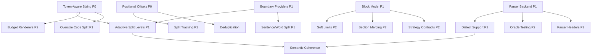

# Стратегическая дорожная карта Chunkana

## Назначение документации

Данная документация представляет стратегический план развития библиотеки Chunkana — ведущего решения для структурно-осознанного чанкования Markdown-документов в контексте RAG и LLM-систем.

Дорожная карта объединяет архитектурные и функциональные улучшения, направленные на укрепление конкурентных позиций Chunkana как специализированной библиотеки для работы с Markdown, сохраняющей структурную целостность документов.

### Связь с текущими возможностями

Chunkana уже обладает сильными сторонами:
- Сохранение атомарных блоков (fenced code, таблицы, LaTeX)
- Иерархическая структура через `header_path`
- Overlap только в metadata (канонический контент без дублей)
- Адаптивный выбор стратегий

Планируемые доработки расширяют эти возможности, добавляя:
- Нативную поддержку токен-бюджетов LLM
- Объяснимость решений чанкера
- Парсерную точность для сложного Markdown
- Семантическую когерентность границ

### Как использовать эту документацию

**Для руководителей и архитекторов**:
- Ознакомьтесь с таблицей сравнения фич и приоритетами
- Оцените конкурентную ценность каждой области
- Используйте для планирования версий и roadmap-коммуникаций

**Для разработчиков**:
- Изучите детальные документы по каждой фиче
- Оцените зависимости и последовательность реализации
- Используйте как reference для дизайн-решений

**Для интеграторов**:
- Понимайте стратегическое направление развития API
- Планируйте миграцию на новые возможности
- Оценивайте влияние на downstream-системы

## Обзор фич и приоритизация

### Таблица сравнения фич

| Область фич | Конкурентная ценность | Влияние на пользователей | Сложность реализации | Стратегический приоритет | Документ |
|------------|---------------------|----------------------|---------------------|----------------------|---------|
| **Token-Aware Sizing** | Критическая | Высокое | Средняя | P0 — Фундамент | [Детальное описание](./features/token-aware-sizing.md) |
| **Позиционные оффсеты** | Высокая | Высокое | Низкая | P0 — Фундамент | [Детальное описание](./features/positional-offsets.md) |
| **Провенанс блоков** | Высокая | Среднее | Средняя | P1 — Дифференциация | [Детальное описание](./features/block-provenance.md) |
| **Адаптивные уровни разбиения** | Очень высокая | Высокое | Высокая | P1 — Дифференциация | [Детальное описание](./features/adaptive-split-levels.md) |
| **Parser Backend** | Высокая | Среднее | Высокая | P1 — Дифференциация | [Детальное описание](./features/parser-backend.md) |
| **Разбиение oversize кода** | Средняя | Высокое | Средняя | P1 — Практичность | [Детальное описание](./features/oversize-code-splitting.md) |
| **Soft/Hard лимиты размера** | Средняя | Среднее | Низкая | P2 — Качество | [Детальное описание](./features/soft-hard-limits.md) |
| **Budget-Aware Renderers** | Средняя | Среднее | Средняя | P2 — Качество | [Детальное описание](./features/budget-aware-renderers.md) |
| **Поддержка диалектов** | Высокая | Среднее | Средняя | P2 — Расширяемость | [Детальное описание](./features/dialect-support.md) |
| **Oracle тестирование** | Средняя | Низкое | Средняя | P2 — Качество | [Детальное описание](./features/oracle-testing.md) |

### Определения приоритетов

#### P0 — Фундамент
Критически важные возможности, которые являются предпосылками для других фич и решают острые проблемы пользователей. Без них библиотека не может эффективно конкурировать в контексте LLM/RAG-систем.

**Ключевые фичи**:
- Token-aware sizing: нативная работа с токен-бюджетами
- Позиционные оффсеты: точная атрибуция источников

**Обоснование**: Современные embedding-модели и LLM оперируют токенами. Символьные лимиты создают непредсказуемое поведение и production-инциденты.

#### P1 — Дифференциация
Фичи, создающие значительные конкурентные преимущества и напрямую устраняющие ключевые ограничения альтернативных решений.

**Ключевые фичи**:
- Провенанс блоков: объяснимость и дебаг
- Адаптивные уровни разбиения: семантическая когерентность
- Parser backend: корректность на сложном Markdown

**Обоснование**: Конкуренты либо игнорируют структуру Markdown, либо работают только с чистым CommonMark. Chunkana должна быть лучшей в обеих областях.

#### P2 — Качество и расширяемость
Улучшения для developer experience, обработки edge cases и интеграции в экосистему.

**Ключевые фичи**:
- Soft/hard лимиты: более ровные чанки
- Budget-aware renderers: гарантии для downstream
- Поддержка диалектов: GFM, MyST, кастомные расширения

**Обоснование**: Полировка UX и расширение применимости на разные Markdown-экосистемы.

## Стратегические ценностные предложения

### Для разработчиков RAG-приложений

**Token-Aware Sizing** гарантирует укладывание чанков в ограничения embedding-моделей и LLM без ручного подбора параметров. Это снижает количество production-инцидентов и улучшает качество retrieval.

**Адаптивные уровни разбиения** сохраняют семантическую когерентность, уважая структуру документа. Это приводит к более релевантным результатам поиска и лучшему контексту для генерации.

**Позиционные оффсеты** обеспечивают точную атрибуцию источников, подсветку в UI и deduplication workflows — критично для production RAG-систем.

### Для владельцев документационных платформ

**Интеграция Parser Backend** корректно обрабатывает сложные диалекты Markdown (GFM, MyST, расширения CommonMark) с гарантиями корректности, устраняя проблемы структурной коррупции.

**Провенанс блоков** обеспечивает прозрачность для аудита качества и дебаг-воркфлоу, когда качество чанкования влияет на retrieval performance.

**Поддержка диалектов** позволяет обрабатывать платформо-специфичные расширения Markdown (admonitions, containers, front-matter) как атомарные единицы, сохраняя авторский замысел.

### Для интеграторов библиотек

**Pluggable Sizer Architecture** абстрагирует измерение размера, позволяя использовать кастомные токенизаторы, byte-лимиты или domain-специфичные метрики без форка.

**Budget-Aware Renderers** гарантируют соответствие размера output для downstream consumers, предотвращая silent failures в token-constrained окружениях.

**Oracle Testing** предоставляет формальные proof correctness, что атомарные границы никогда не нарушаются — поддержка compliance и reliability requirements.

## Инварианты дизайна

Все фичи дорожной карты должны сохранять эти фундаментальные принципы дизайна:

### Принцип канонического контента
`chunk.content` остаётся авторитетным источником, содержащим только оригинальный текст документа без дублирования overlap. Все обогащение контекстом происходит в metadata или rendering layers.

### Overlap только в metadata
Previous и next контекст хранятся исключительно в `metadata.previous_content` и `metadata.next_content`. Renderers могут композировать views, но никогда не мутируют границы чанков.

### Чистые renderers
Rendering functions остаются side-effect-free трансформациями. Они не модифицируют `Chunk` объекты и не изменяют решения о границах.

### Сохранение атомарных блоков
Fenced code blocks, таблицы и обозначенные структурные единицы остаются неделимыми при включённых `preserve_*` флагах, за исключением explicit opt-in splitting policies.

### Стабильная иерархия заголовков
`header_path` поддерживает строковый формат `"/H1/H2/H3"` как единый источник истины для структуры документа.

### Совместимость с baseline
Все новые фичи по умолчанию отключены. Golden output тесты гарантируют zero regression в дефолтном поведении между версиями.

## Подход к реализации

### Поэтапная стратегия внедрения

#### Фаза 1: Фундамент (P0)
Реализация token-aware sizing и позиционных оффсетов как ортогональных улучшений. Они служат предпосылками для адаптивных стратегий и budget-aware фич.

**Длительность**: 4-6 недель  
**Ключевые deliverables**: Sizer architecture, offset computation, token mode testing

#### Фаза 2: Дифференциация (P1)
Доставка провенанса блоков, адаптивных уровней разбиения и parser backend. Эти фичи формируют конкурентный ров Chunkana против character-only chunkers.

**Длительность**: 8-12 недель  
**Ключевые deliverables**: Block model, split level hierarchy, markdown-it integration

#### Фаза 3: Доводка (P2)
Добавление soft limits, budget renderers, dialect profiles и oracle testing для полировки UX и обеспечения production readiness.

**Длительность**: 6-8 недель  
**Ключевые deliverables**: Soft/hard sizing, budgeted rendering, dialect presets

### Митигация рисков

**Dependency Creep**: Опциональные backends устанавливаются как extras, core остаётся dependency-free.

**Breaking Changes**: Feature flags и version guards предотвращают silent behaviour changes.

**Performance Degradation**: Memoization strategies и lazy evaluation для size measurement гарантируют ограниченный overhead.

## Зависимости между фичами

### Token Sizing → Все size-dependent фичи
Sizer abstraction должен быть реализован до adaptive splitting, budget renderers или oversize handling для корректной работы в token mode.

### Block Model → Продвинутые стратегии
Провенанс и структурный анализ требуют унифицированной block representation до того, как soft limits, section merging или tree-aware strategies смогут работать.

### Parser Backend → Поддержка диалектов
Structural backend предоставляет механизм; dialect profiles конфигурируют его поведение для специфичных Markdown flavors.

### Позиционные оффсеты → Отслеживание split
Character/byte ranges обеспечивают точную реконструкцию parent-child relationships при subdivision чанков.

## Граф зависимостей

## Метрики успеха

### Функциональные метрики
- Нулевые нарушения атомарных границ в oracle tests
- Token budget compliance rate ≥99.9% в adaptive mode
- Positional offset accuracy: 100% восстановление текста по оффсетам

### Метрики качества
- Reduction chunk size variance ≥30% с soft limits
- Retrieval relevance improvement ≥15% с semantic levels (на стандартном корпусе)
- False boundary detection ≤0.1% с parser backend

### Метрики адопции
- Reduction time-to-correct-configuration ≥50% с token sizing
- Reduction support issues ≥40% с provenance metadata
- Reduction integration effort ≥60% с budget-aware renderers

## Стратегия миграции

### Для существующих пользователей

**No-Op Migration**: Дефолтная конфигурация сохраняет точное текущее поведение. Opt-in adoption в темпе пользователя.

**Incremental Enhancement**: Фичи могут включаться независимо без требования wholesale strategy changes.

**Compatibility Guarantees**: Semantic versioning с чёткой коммуникацией breaking changes.

### Для новых пользователей

**Guided Profiles**: Common use cases (RAG, documentation, note-taking) поставляются с рекомендованными presets.

**Progressive Disclosure**: Простой API surface для базового использования, продвинутые фичи discoverable через configuration.

## Открытые вопросы и направления исследований

### Семантическое определение границ
Помимо структурного Markdown-анализа, могут ли лёгкие лингвистические эвристики улучшить chunk coherence без heavyweight NLP dependencies?

### Cross-Document Deduplication
С позиционными оффсетами, можем ли мы эффективно детектировать и обрабатывать дублированный контент между версиями документов?

### Streaming Partial Updates
Может ли incremental chunking поддерживать real-time document editing scenarios для интерактивных приложений?

### Иерархический Retrieval
Как parent-child relationships в provenance metadata должны информировать two-stage retrieval strategies?

## Governance и review

Эта дорожная карта представляет стратегический интент, а не binding commitment. Приоритеты могут смещаться на основе:
- Обратной связи пользователей и usage analytics
- Emerging LLM/embedding model capabilities
- Эволюции конкурентного ландшафта
- Технических feasibility discoveries во время реализации

Feature proposals проходят design review перед реализацией. Значительные архитектурные изменения требуют RFC process с stakeholder input.

## Навигация по документации фич

Все фичи организованы в отдельные файлы в директории [`features/`](./features/). Ниже представлено краткое описание ключевых областей развития:

### LLM-нативная точность

Группа фич, направленных на нативную поддержку токен-бюджетов и точную атрибуцию источников:

- **[Token-Aware Sizing](./features/token-aware-sizing.md)** (P0): Pluggable архитектура измерения размера, поддержка токенов, символов, байтов и custom метрик
- **[Позиционные оффсеты](./features/positional-offsets.md)** (P0): Character и byte offsets для pixel-perfect highlighting и source attribution
- **[Budget-Aware Renderers](./features/budget-aware-renderers.md)** (P2): Гарантированное соблюдение бюджета при rendering с автоматическим trimming overlap

### Объяснимое чанкование

Фичи для превращения Chunkana в observable систему с прозрачностью решений:

- **[Провенанс блоков](./features/block-provenance.md)** (P1): Отслеживание Markdown-блоков в составе чанков для дебага и quality assurance
- **[Soft/Hard лимиты](./features/soft-hard-limits.md)** (P2): Двухпороговый контроль размера для естественных boundaries

### Парсер как источник истины

Фичи для устранения структурных ошибок через использование реального парсера:

- **[Parser Backend](./features/parser-backend.md)** (P1): Абстракция structural backend с поддержкой heuristic и parser-based режимов
- **[Поддержка диалектов](./features/dialect-support.md)** (P2): Configurable dialect presets для GFM, MyST и custom расширений
- **[Oracle тестирование](./features/oracle-testing.md)** (P2): Automated verification формальных свойств chunking

### Токен-семантическое чанкование

Фичи для комбинации token-awareness с семантической когерентностью:

- **[Адаптивные уровни разбиения](./features/adaptive-split-levels.md)** (P1): Формализованная иерархия split levels с predictable degradation
- **[Разбиение oversize кода](./features/oversize-code-splitting.md)** (P1): Structure-aware splitting для больших code blocks по function/class boundaries

## Связанная документация

- **Текущая архитектура**: См. `docs/architecture/` для implementation details существующих фич
- **Feature Research**: Индивидуальные analysis documents в `docs/research/features/`
- **API Stability**: Обращайтесь к `CHANGELOG.md` и `MIGRATION_GUIDE.md` для version policy
- **Testing Standards**: Консультируйтесь с `docs/guides/testing-guide.md` для oracle test requirements

## Поддержка дорожной карты

**Cadence обзора**: Ежеквартальная оценка приоритетов и прогресса  
**Триггеры обновления**: Major version releases, значительные user research findings, архитектурные решения  
**Stakeholders**: Maintainers, активные контрибьюторы, enterprise users, RAG platform integrators

---

**Последнее обновление**: Январь 2026  
**Следующий обзор**: Апрель 2026  
**Статус**: Активное планирование
